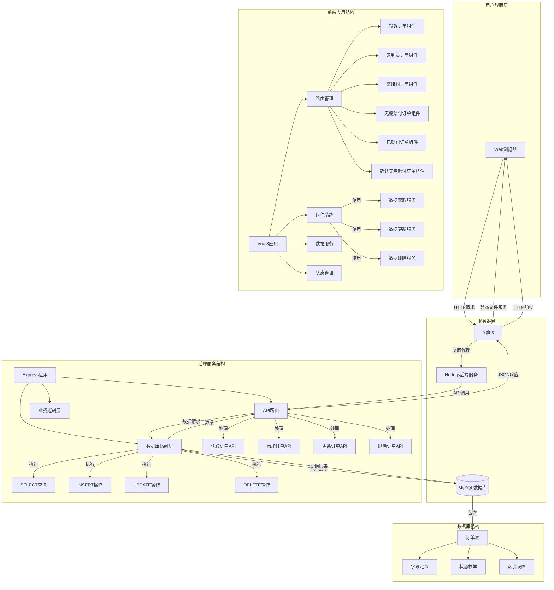

# 详细系统架构图

## 系统架构详细说明

### 1. 前端架构

#### 1.1 核心组件
- **App.vue**: 根组件，包含整体布局和导航菜单
- **路由组件**:
  - ComplaintForm.vue: 投诉订单页面
  - BasicForm.vue: 未判责订单页面
  - NeedCompensationOrders.vue: 需赔付订单页面
  - NoCompensationOrders.vue: 无需赔付订单页面
  - CompensatedOrders.vue: 已赔付订单页面
  - ConfirmedNoCompensationOrders.vue: 确认无需赔付订单页面

#### 1.2 通用组件
- **DataTable.vue**: 数据表格组件，支持增删改查操作
- **RichEditor.vue**: 富文本编辑器组件
- **FilterDialog.vue**: 筛选对话框组件

#### 1.3 服务层
- **dataService.js**: 提供统一的数据访问接口
  - fetchData(): 获取所有订单
  - fetchDataByStatus(): 根据状态获取订单
  - addData(): 添加订单
  - updateData(): 更新订单
  - deleteData(): 删除订单

#### 1.4 状态管理
- **reportStore.js**: 使用Pinia进行全局状态管理

### 2. 后端架构

#### 2.1 服务入口
- **server.js**: 应用入口文件，初始化Express应用和中间件

#### 2.2 路由层
- **routes/orders.js**: 订单相关API路由
  - GET /api/orders: 获取所有订单
  - GET /api/orders/status/:status: 根据状态获取订单
  - POST /api/orders: 创建新订单
  - PUT /api/orders/:id: 更新订单
  - DELETE /api/orders/:id: 删除订单

#### 2.3 数据访问层
- **config/db.js**: 数据库连接配置，创建连接池

#### 2.4 数据库初始化与迁移
- **setup/dbSetup.js**: 数据库和表结构初始化脚本
- **setup/migrate.js**: 数据库迁移脚本

### 3. 数据库设计

#### 3.1 订单表结构
- **orders表**:
  - id: 主键，自增
  - pay_id: 支付编码，VARCHAR(28)
  - complaint_channel: 投诉渠道，VARCHAR
  - phone: 电话，VARCHAR(11)
  - order_amount: 订单金额，DECIMAL
  - situation_explanation: 情况说明，TEXT
  - indemnitor: 赔付人，VARCHAR
  - compensation_amount: 赔付金额，DECIMAL
  - status: 状态，ENUM类型
  - time: 时间，DATETIME
  - note: 备注，TEXT
  - classification_of_payers: 赔付方分类，VARCHAR
  - detailed_explanation: 详细说明，TEXT

#### 3.2 状态枚举值
- 未处理订单/投诉
- 需赔付订单
- 无需赔付订单
- 确认可赔付
- 确认已赔付
- 确认无需赔付
- 被驳回需赔付订单
- 被驳回无需赔付

### 4. 数据流说明

#### 4.1 查询数据流程
1. 用户访问页面，Vue组件调用dataService.fetchData()或fetchDataByStatus()
2. dataService发送HTTP GET请求到后端API
3. Express路由接收请求，调用数据库查询方法
4. 数据库执行SELECT查询，返回结果
5. 后端将数据库结果转换为前端期望的格式
6. 后端返回JSON响应给前端
7. 前端接收数据并更新组件状态

#### 4.2 更新数据流程
1. 用户在页面上修改数据，触发更新操作
2. Vue组件调用dataService.updateData()方法
3. dataService发送HTTP PUT请求到后端API，携带更新数据
4. Express路由接收请求，验证数据格式
5. 后端将前端数据格式转换为数据库格式
6. 执行UPDATE SQL操作更新数据库
7. 数据库返回更新结果
8. 后端返回更新后的数据给前端
9. 前端更新本地数据状态

### 5. 部署架构

#### 5.1 服务器组件
- **Nginx**: 作为反向代理和静态文件服务器
- **Node.js**: 运行Express应用
- **MySQL**: 存储订单数据

#### 5.2 部署流程
1. 使用Vite构建前端应用，生成静态文件
2. 将静态文件部署到Nginx服务器目录
3. 配置Nginx反向代理，将API请求转发到Node.js服务
4. 启动Node.js后端服务
5. 确保MySQL数据库服务运行正常

### 6. 安全与权限

#### 6.1 数据验证
- 前端和服务端均进行数据格式验证
- 支付编码必须为28位
- 电话号码必须为11位

#### 6.2 状态管理
- 数据库枚举值与前端状态值保持一致
- 状态转换通过映射表进行控制

#### 6.3 错误处理
- 统一的错误处理机制
- 详细的日志记录
- 用户友好的错误提示