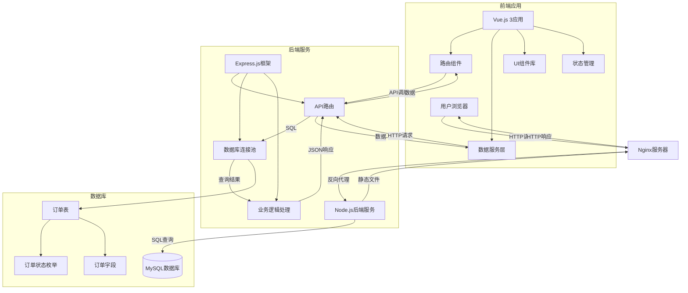

# 补偿表单系统架构图

## 系统组件说明

### 1. 前端层 (Vue.js 3 + Vite)
- **技术栈**: Vue 3 Composition API, Vite构建工具
- **主要组件**:
  - `App.vue` - 主应用组件，包含路由和菜单
  - 路由组件:
    - `ComplaintForm.vue` - 投诉订单页面
    - `BasicForm.vue` - 未判责订单页面
    - `NeedCompensationOrders.vue` - 需赔付订单页面
    - `NoCompensationOrders.vue` - 无需赔付订单页面
    - `CompensatedOrders.vue` - 已赔付订单页面
    - `ConfirmedNoCompensationOrders.vue` - 确认无需赔付订单页面
  - 通用组件:
    - `DataTable.vue` - 数据表格组件
    - `RichEditor.vue` - 富文本编辑器
    - `FilterDialog.vue` - 筛选对话框

### 2. 后端层 (Node.js + Express)
- **技术栈**: Node.js, Express.js
- **主要模块**:
  - `server.js` - 服务器入口文件
  - `routes/orders.js` - 订单相关API路由
  - `config/db.js` - 数据库配置
  - `setup/dbSetup.js` - 数据库初始化
  - `setup/migrate.js` - 数据库迁移脚本

### 3. 数据库层 (MySQL)
- **数据库**: MySQL
- **主要表**:
  - `orders` - 订单表
    - 包含订单的所有信息字段
    - `status` 字段使用枚举类型存储订单状态

## 数据流向

1. **用户操作**: 用户在浏览器中与Vue应用交互
2. **前端请求**: Vue组件通过数据服务层发送HTTP请求到后端API
3. **Nginx代理**: 请求通过Nginx反向代理转发到Node.js后端服务
4. **后端处理**: Express应用接收请求，处理业务逻辑
5. **数据库操作**: 后端通过数据库连接池执行SQL查询或更新
6. **响应返回**: 数据库结果返回给后端，后端处理后返回JSON响应
7. **前端更新**: 前端接收响应并更新UI组件状态

## 状态管理

订单状态枚举值:
- 未处理订单/投诉
- 需赔付订单
- 无需赔付订单
- 确认可赔付
- 确认已赔付
- 确认无需赔付
- 被驳回需赔付订单
- 被驳回无需赔付

## 部署架构

- **生产环境**: Nginx作为反向代理和静态文件服务器
- **应用服务器**: Node.js运行Express应用
- **数据库服务器**: MySQL数据库
- **前端构建**: 使用Vite构建的静态资源由Nginx提供服务